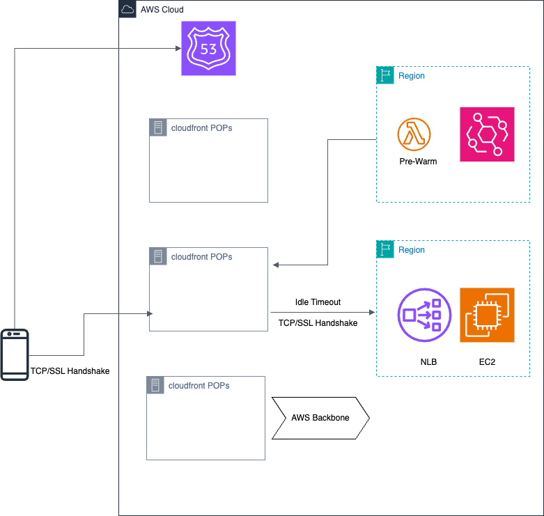

# Prewarm cloudfront to reduce the request latency of infrequent dynamic HTTPS requests

## Introduction

CloudFront can be used to accelerate dynamic HTTPS APIs from the backend. However, when dynamic requests are infrequent (less than 1 request per minute for specific IP of cloudfront POP), request latency can increase due to the establishing of TCP/SSL connections between CloudFront POP locations and the backend custom domain.

This issue can be addressed through the following two steps:

1. Adjust the Keep-alive timeout parameter for the CloudFront custom domain:
   Increase the default value from 5 seconds to 60 seconds. This extended timeout helps maintain connections for longer periods, reducing the need for TCP/SSL(handshake) reconnections.
   https://docs.aws.amazon.com/AmazonCloudFront/latest/DeveloperGuide/distribution-web-values-specify.html#DownloadDistValuesOriginKeepaliveTimeout

   > Make sure that the CloudFront Keep-Alive < backend https server Keep-Alive < NLB TCP idle timeout (default 350s) / ALB idle_timeout.timeout_seconds (default 60s)

2. Implement Lambda-based prewarming solution:
   Use Lambda functions to "prewarm" CloudFront PoP locations in regions with less frequent access. This approach helps reduce the probability of new TCP/SSL handshakes by maintaining active connections, thereby decreasing overall latency.


## Architecture



## Implementation
### The backend application in ecs-code/current-time-app

1. go mod init current-time-app
2. main.go and main_test.go
3. Dockerfile

### Create ECR 

```
aws ecr create-repository --repository-name current-time-app
```

### Pushing docker images to ECR

https://docs.aws.amazon.com/AmazonECR/latest/userguide/docker-push-ecr-image.html


```
aws ecr get-login-password --region <region> | docker login --username AWS --password-stdin <aws_account_id>.dkr.ecr.<region>.amazonaws.com
```

```
# Build your Docker image
docker build -t current-time-app .

# Tag your image for ECR
docker tag current-time-app:latest <your_account_id>.dkr.ecr.<region>.amazonaws.com/current-time-app:latest

# Push your image to ECR
docker push <your_account_id>.dkr.ecr.<region>.amazonaws.com/current-time-app:latest
```

## Deploy Verification environment via CDK

### Backend stack

```
./cdk-deploy-to.sh <backend account> <backend region> CloudfrontDynamicAPIStack
```

### Prewarm stack

```
./cdk-deploy-to.sh <pre-warm account> <pre-warm region> LambdaPrewarmStack
```

## Test

### Test script

**check_url_timing.sh**

```
#!/bin/bash

# Check if a URL is provided
if [ $# -eq 0 ]; then
    echo "Usage: $0 <URL>"
    exit 1
fi

# Store the URL from the command line argument
URL=$1

# Execute the curl command and store the output
output=$(curl -w "%{time_total},%{time_namelookup},%{time_connect},%{time_appconnect},%{time_starttransfer}" -o /dev/null -s -D - "$URL")

# Extract the x-amz-cf-id from the headers
x_amz_cf_id=$(echo "$output" | grep -i "x-amz-cf-id:" | awk '{print $2}' | tr -d '\r')

# Extract the timing information
timing=$(echo "$output" | tail -n 1)

# Combine all information into a single line
echo "$timing,$x_amz_cf_id" | awk -F',' '{printf "Total: %.6f, DNS: %.6f, TCP: %.6f, SSL: %.6f, Request: %.6f, x-amz-cf-id: %s\n", $1, $2, $3, $4, $5, $6}'
```

### Get a connection data for a domain
```
./check_url_timing.sh https://<domain>/
```

### Test for a range of time

```
for i in `seq 1 100`; do ./check_url_timing.sh https://<domain>/ ; sleep <seconds>; done
```

## Test result

### Frontend Hong Kong Region -> Backend Frankfurt Region

#### Idle timeout 5s, no prewarm

```
$ for i in `seq 1 20`; do ./check_url_timing.sh  https://xxxx.cloudfront.net ; sleep 90; done
Total: 0.631197, DNS: 0.003804, TCP: 0.004299, SSL: 0.042336, Request: 0.631115, x-amz-cf-id: 
Total: 0.618055, DNS: 0.000918, TCP: 0.001424, SSL: 0.039718, Request: 0.617972, x-amz-cf-id: 
Total: 0.621859, DNS: 0.000832, TCP: 0.001379, SSL: 0.039802, Request: 0.621776, x-amz-cf-id: 
Total: 0.668675, DNS: 0.000836, TCP: 0.001345, SSL: 0.041569, Request: 0.668593, x-amz-cf-id: 
Total: 0.611971, DNS: 0.000837, TCP: 0.001345, SSL: 0.039793, Request: 0.611884, x-amz-cf-id: 
Total: 0.621105, DNS: 0.000803, TCP: 0.001320, SSL: 0.040702, Request: 0.621005, x-amz-cf-id: 
Total: 0.614032, DNS: 0.004007, TCP: 0.004548, SSL: 0.043082, Request: 0.613953, x-amz-cf-id: 
Total: 0.622345, DNS: 0.000803, TCP: 0.001318, SSL: 0.039332, Request: 0.622263, x-amz-cf-id: 
Total: 0.663615, DNS: 0.000826, TCP: 0.001387, SSL: 0.039646, Request: 0.663536, x-amz-cf-id: 
Total: 0.628964, DNS: 0.000772, TCP: 0.001278, SSL: 0.041195, Request: 0.628887, x-amz-cf-id: 
Total: 0.613367, DNS: 0.000873, TCP: 0.001379, SSL: 0.039309, Request: 0.613291, x-amz-cf-id: 
Total: 0.626853, DNS: 0.000826, TCP: 0.001336, SSL: 0.040104, Request: 0.626764, x-amz-cf-id: 
Total: 0.632974, DNS: 0.003771, TCP: 0.004286, SSL: 0.043580, Request: 0.632894, x-amz-cf-id: 
Total: 0.619306, DNS: 0.000881, TCP: 0.001386, SSL: 0.039923, Request: 0.619219, x-amz-cf-id: 
Total: 0.611068, DNS: 0.000816, TCP: 0.001337, SSL: 0.039636, Request: 0.610979, x-amz-cf-id: 
Total: 0.620116, DNS: 0.000798, TCP: 0.001318, SSL: 0.040605, Request: 0.620041, x-amz-cf-id: 
Total: 0.610948, DNS: 0.000791, TCP: 0.001305, SSL: 0.039683, Request: 0.610864, x-amz-cf-id: 
Total: 0.615885, DNS: 0.000783, TCP: 0.001280, SSL: 0.039336, Request: 0.615805, x-amz-cf-id: 
Total: 0.614098, DNS: 0.004042, TCP: 0.004543, SSL: 0.042416, Request: 0.614020, x-amz-cf-id: 
Total: 0.631520, DNS: 0.000769, TCP: 0.001310, SSL: 0.039526, Request: 0.631439, x-amz-cf-id: 
```


#### Idle timeout 60s, prewarmed

```
$ for i in `seq 1 20`; do ./check_url_timing.sh  https://xxxx.cloudfront.net ; sleep 90; done
Total: 0.236349, DNS: 0.003746, TCP: 0.004255, SSL: 0.042397, Request: 0.236275, x-amz-cf-id: 
Total: 0.239753, DNS: 0.003724, TCP: 0.004218, SSL: 0.042321, Request: 0.239681, x-amz-cf-id: 
Total: 0.238094, DNS: 0.003660, TCP: 0.004255, SSL: 0.042600, Request: 0.238013, x-amz-cf-id: 
Total: 0.236742, DNS: 0.003749, TCP: 0.004243, SSL: 0.042153, Request: 0.236669, x-amz-cf-id: 
Total: 0.238575, DNS: 0.004028, TCP: 0.004526, SSL: 0.043267, Request: 0.238491, x-amz-cf-id: 
Total: 0.240252, DNS: 0.005052, TCP: 0.005556, SSL: 0.046911, Request: 0.240179, x-amz-cf-id: 
Total: 0.238486, DNS: 0.005314, TCP: 0.005844, SSL: 0.047110, Request: 0.238410, x-amz-cf-id: 
Total: 0.235062, DNS: 0.004211, TCP: 0.004732, SSL: 0.042614, Request: 0.234988, x-amz-cf-id: 
Total: 0.237372, DNS: 0.004062, TCP: 0.004553, SSL: 0.043352, Request: 0.237296, x-amz-cf-id:
Total: 0.233805, DNS: 0.003672, TCP: 0.004173, SSL: 0.042546, Request: 0.233728, x-amz-cf-id: 
Total: 0.241692, DNS: 0.006672, TCP: 0.007346, SSL: 0.045636, Request: 0.241616, x-amz-cf-id: 
Total: 0.236032, DNS: 0.004052, TCP: 0.004559, SSL: 0.043933, Request: 0.235958, x-amz-cf-id: 
Total: 0.238964, DNS: 0.004003, TCP: 0.004507, SSL: 0.042852, Request: 0.238888, x-amz-cf-id: 
Total: 0.235819, DNS: 0.004033, TCP: 0.004545, SSL: 0.042581, Request: 0.235742, x-amz-cf-id: 
Total: 0.240108, DNS: 0.003857, TCP: 0.004361, SSL: 0.042264, Request: 0.240032, x-amz-cf-id: 
Total: 0.238539, DNS: 0.003972, TCP: 0.004476, SSL: 0.042969, Request: 0.238459, x-amz-cf-id: 
Total: 0.237954, DNS: 0.004235, TCP: 0.004726, SSL: 0.042757, Request: 0.237871, x-amz-cf-id: 
Total: 0.235127, DNS: 0.004254, TCP: 0.004763, SSL: 0.042777, Request: 0.235053, x-amz-cf-id: 
Total: 0.236552, DNS: 0.004086, TCP: 0.004605, SSL: 0.042903, Request: 0.236479, x-amz-cf-id: 
Total: 0.240316, DNS: 0.004130, TCP: 0.004638, SSL: 0.042668, Request: 0.240241, x-amz-cf-id: 

```

